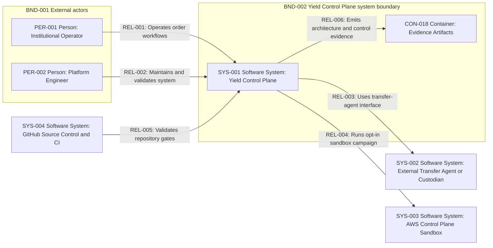

# C4 00 System Context

```mermaid
flowchart LR
  subgraph BND001["BND-001 External actors"]
    PER001["PER-001 Person: Institutional Operator"]
    PER002["PER-002 Person: Platform Engineer"]
  end

  subgraph BND002["BND-002 Yield Control Plane system boundary"]
    SYS001["SYS-001 Software System: Yield Control Plane"]
    CON018["CON-018 Container: Evidence Artifacts"]
  end

  SYS002["SYS-002 Software System: External Transfer Agent or Custodian"]
  SYS003["SYS-003 Software System: AWS Control Plane Sandbox"]
  SYS004["SYS-004 Software System: GitHub Source Control and CI"]

  PER001 -->|REL-001: Operates order workflows| SYS001
  PER002 -->|REL-002: Maintains and validates system| SYS001
  SYS001 -->|REL-003: Uses transfer-agent interface| SYS002
  SYS001 -->|REL-004: Runs opt-in sandbox campaign| SYS003
  SYS004 -->|REL-005: Validates repository gates| SYS001
  SYS001 -->|REL-006: Emits architecture and control evidence| CON018
```
