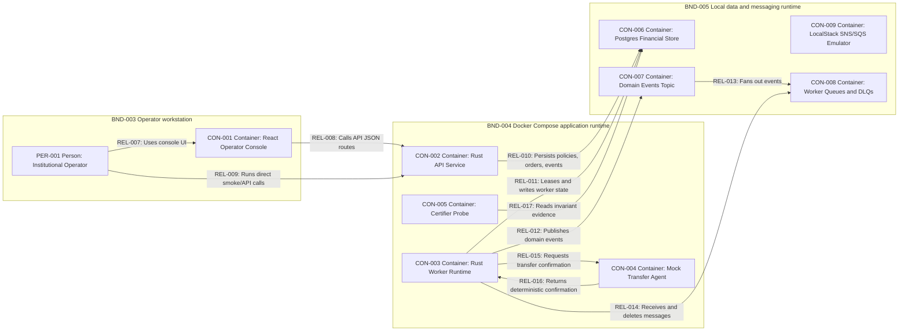

# C4 01 Local Runtime Containers

```mermaid
flowchart LR
  subgraph BND003["BND-003 Operator workstation"]
    PER001["PER-001 Person: Institutional Operator"]
    CON001["CON-001 Container: React Operator Console"]
  end

  subgraph BND004["BND-004 Docker Compose application runtime"]
    CON002["CON-002 Container: Rust API Service"]
    CON003["CON-003 Container: Rust Worker Runtime"]
    CON004["CON-004 Container: Mock Transfer Agent"]
    CON005["CON-005 Container: Certifier Probe"]
  end

  subgraph BND005["BND-005 Local data and messaging runtime"]
    CON006["CON-006 Container: Postgres Financial Store"]
    CON009["CON-009 Container: LocalStack SNS/SQS Emulator"]
    CON007["CON-007 Container: Domain Events Topic"]
    CON008["CON-008 Container: Worker Queues and DLQs"]
  end

  PER001 -->|REL-007: Uses console UI| CON001
  CON001 -->|REL-008: Calls API JSON routes| CON002
  PER001 -->|REL-009: Runs direct smoke/API calls| CON002
  CON002 -->|REL-010: Persists policies, orders, events| CON006
  CON003 -->|REL-011: Leases and writes worker state| CON006
  CON003 -->|REL-012: Publishes domain events| CON007
  CON007 -->|REL-013: Fans out events| CON008
  CON003 -->|REL-014: Receives and deletes messages| CON008
  CON003 -->|REL-015: Requests transfer confirmation| CON004
  CON004 -->|REL-016: Returns deterministic confirmation| CON003
  CON005 -->|REL-017: Reads invariant evidence| CON006
```
