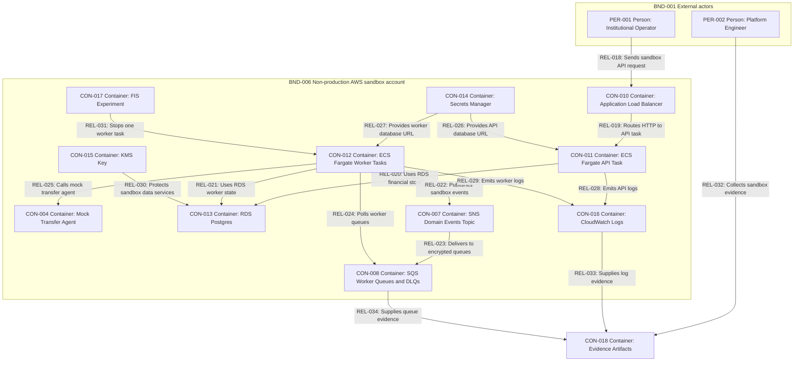

# C4 02 AWS Sandbox Containers

```mermaid
flowchart TB
  subgraph BND001["BND-001 External actors"]
    PER001["PER-001 Person: Institutional Operator"]
    PER002["PER-002 Person: Platform Engineer"]
  end

  subgraph BND006["BND-006 Non-production AWS sandbox account"]
    CON010["CON-010 Container: Application Load Balancer"]
    CON011["CON-011 Container: ECS Fargate API Task"]
    CON012["CON-012 Container: ECS Fargate Worker Tasks"]
    CON004["CON-004 Container: Mock Transfer Agent"]
    CON013["CON-013 Container: RDS Postgres"]
    CON007["CON-007 Container: SNS Domain Events Topic"]
    CON008["CON-008 Container: SQS Worker Queues and DLQs"]
    CON014["CON-014 Container: Secrets Manager"]
    CON015["CON-015 Container: KMS Key"]
    CON016["CON-016 Container: CloudWatch Logs"]
    CON017["CON-017 Container: FIS Experiment"]
  end

  CON018["CON-018 Container: Evidence Artifacts"]

  PER001 -->|REL-018: Sends sandbox API request| CON010
  CON010 -->|REL-019: Routes HTTP to API task| CON011
  CON011 -->|REL-020: Uses RDS financial store| CON013
  CON012 -->|REL-021: Uses RDS worker state| CON013
  CON012 -->|REL-022: Publishes sandbox events| CON007
  CON007 -->|REL-023: Delivers to encrypted queues| CON008
  CON012 -->|REL-024: Polls worker queues| CON008
  CON012 -->|REL-025: Calls mock transfer agent| CON004
  CON014 -->|REL-026: Provides API database URL| CON011
  CON014 -->|REL-027: Provides worker database URL| CON012
  CON011 -->|REL-028: Emits API logs| CON016
  CON012 -->|REL-029: Emits worker logs| CON016
  CON015 -->|REL-030: Protects sandbox data services| CON013
  CON017 -->|REL-031: Stops one worker task| CON012
  PER002 -->|REL-032: Collects sandbox evidence| CON018
  CON016 -->|REL-033: Supplies log evidence| CON018
  CON008 -->|REL-034: Supplies queue evidence| CON018
```
