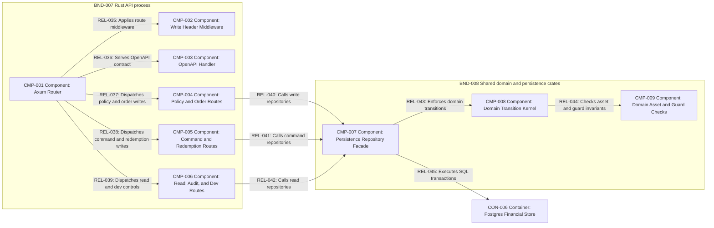

# C4 03 API Components

```mermaid
flowchart LR
  subgraph BND007["BND-007 Rust API process"]
    CMP001["CMP-001 Component: Axum Router"]
    CMP002["CMP-002 Component: Write Header Middleware"]
    CMP003["CMP-003 Component: OpenAPI Handler"]
    CMP004["CMP-004 Component: Policy and Order Routes"]
    CMP005["CMP-005 Component: Command and Redemption Routes"]
    CMP006["CMP-006 Component: Read, Audit, and Dev Routes"]
  end

  subgraph BND008["BND-008 Shared domain and persistence crates"]
    CMP007["CMP-007 Component: Persistence Repository Facade"]
    CMP008["CMP-008 Component: Domain Transition Kernel"]
    CMP009["CMP-009 Component: Domain Asset and Guard Checks"]
  end

  CON006["CON-006 Container: Postgres Financial Store"]

  CMP001 -->|REL-035: Applies route middleware| CMP002
  CMP001 -->|REL-036: Serves OpenAPI contract| CMP003
  CMP001 -->|REL-037: Dispatches policy and order writes| CMP004
  CMP001 -->|REL-038: Dispatches command and redemption writes| CMP005
  CMP001 -->|REL-039: Dispatches read and dev controls| CMP006
  CMP004 -->|REL-040: Calls write repositories| CMP007
  CMP005 -->|REL-041: Calls command repositories| CMP007
  CMP006 -->|REL-042: Calls read repositories| CMP007
  CMP007 -->|REL-043: Enforces domain transitions| CMP008
  CMP008 -->|REL-044: Checks asset and guard invariants| CMP009
  CMP007 -->|REL-045: Executes SQL transactions| CON006
```
