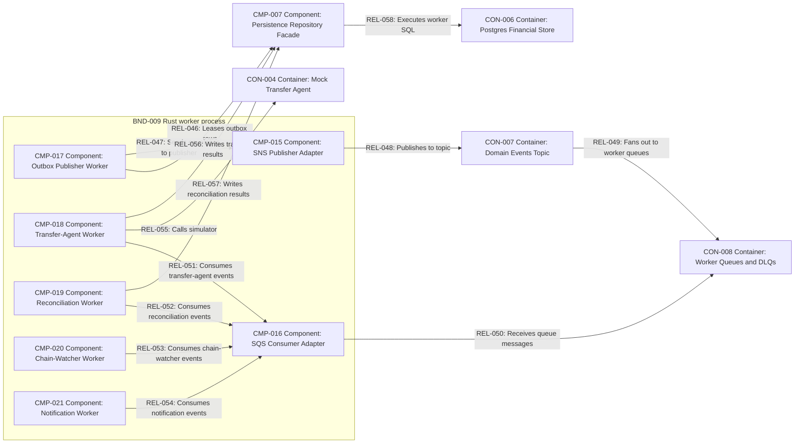

# C4 04 Worker Components

```mermaid
flowchart LR
  subgraph BND009["BND-009 Rust worker process"]
    CMP017["CMP-017 Component: Outbox Publisher Worker"]
    CMP018["CMP-018 Component: Transfer-Agent Worker"]
    CMP019["CMP-019 Component: Reconciliation Worker"]
    CMP020["CMP-020 Component: Chain-Watcher Worker"]
    CMP021["CMP-021 Component: Notification Worker"]
    CMP015["CMP-015 Component: SNS Publisher Adapter"]
    CMP016["CMP-016 Component: SQS Consumer Adapter"]
  end

  CMP007["CMP-007 Component: Persistence Repository Facade"]
  CON004["CON-004 Container: Mock Transfer Agent"]
  CON006["CON-006 Container: Postgres Financial Store"]
  CON007["CON-007 Container: Domain Events Topic"]
  CON008["CON-008 Container: Worker Queues and DLQs"]

  CMP017 -->|REL-046: Leases outbox rows| CMP007
  CMP017 -->|REL-047: Sends envelopes to publisher| CMP015
  CMP015 -->|REL-048: Publishes to topic| CON007
  CON007 -->|REL-049: Fans out to worker queues| CON008
  CMP016 -->|REL-050: Receives queue messages| CON008
  CMP018 -->|REL-051: Consumes transfer-agent events| CMP016
  CMP019 -->|REL-052: Consumes reconciliation events| CMP016
  CMP020 -->|REL-053: Consumes chain-watcher events| CMP016
  CMP021 -->|REL-054: Consumes notification events| CMP016
  CMP018 -->|REL-055: Calls simulator| CON004
  CMP018 -->|REL-056: Writes transfer results| CMP007
  CMP019 -->|REL-057: Writes reconciliation results| CMP007
  CMP007 -->|REL-058: Executes worker SQL| CON006
```
