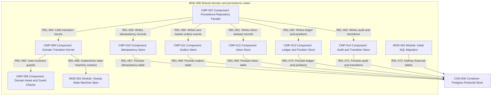

# C4 05 Persistence and Domain Components

```mermaid
flowchart TB
  subgraph BND008["BND-008 Shared domain and persistence crates"]
    CMP007["CMP-007 Component: Persistence Repository Facade"]
    CMP008["CMP-008 Component: Domain Transition Kernel"]
    CMP009["CMP-009 Component: Domain Asset and Guard Checks"]
    CMP010["CMP-010 Component: Idempotency Store"]
    CMP011["CMP-011 Component: Outbox Store"]
    CMP012["CMP-012 Component: Inbox Store"]
    CMP013["CMP-013 Component: Ledger and Position Store"]
    CMP014["CMP-014 Component: Audit and Transition Store"]
    MOD001["MOD-001 Module: Sweep State Machine Spec"]
    MOD002["MOD-002 Module: Initial SQL Migration"]
  end

  CON006["CON-006 Container: Postgres Financial Store"]

  CMP007 -->|REL-059: Writes idempotency records| CMP010
  CMP007 -->|REL-060: Writes and leases outbox events| CMP011
  CMP007 -->|REL-061: Writes inbox dedupe records| CMP012
  CMP007 -->|REL-062: Writes ledger and positions| CMP013
  CMP007 -->|REL-063: Writes audit and transitions| CMP014
  CMP007 -->|REL-064: Calls transition kernel| CMP008
  CMP008 -->|REL-065: Uses invariant guards| CMP009
  CMP008 -->|REL-066: Implements state-machine contract| MOD001
  CMP010 -->|REL-067: Persists idempotency table| CON006
  CMP011 -->|REL-068: Persists outbox table| CON006
  CMP012 -->|REL-069: Persists inbox table| CON006
  CMP013 -->|REL-070: Persists ledger and positions| CON006
  CMP014 -->|REL-071: Persists audit and transitions| CON006
  MOD002 -->|REL-072: Defines financial tables| CON006
```
