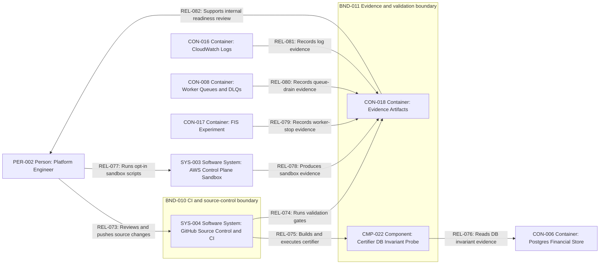

# C4 06 CI and Evidence Operations

```mermaid
flowchart LR
  PER002["PER-002 Person: Platform Engineer"]

  subgraph BND010["BND-010 CI and source-control boundary"]
    SYS004["SYS-004 Software System: GitHub Source Control and CI"]
  end

  subgraph BND011["BND-011 Evidence and validation boundary"]
    CON018["CON-018 Container: Evidence Artifacts"]
    CMP022["CMP-022 Component: Certifier DB Invariant Probe"]
  end

  SYS003["SYS-003 Software System: AWS Control Plane Sandbox"]
  CON006["CON-006 Container: Postgres Financial Store"]
  CON008["CON-008 Container: Worker Queues and DLQs"]
  CON016["CON-016 Container: CloudWatch Logs"]
  CON017["CON-017 Container: FIS Experiment"]

  PER002 -->|REL-073: Reviews and pushes source changes| SYS004
  SYS004 -->|REL-074: Runs validation gates| CON018
  SYS004 -->|REL-075: Builds and executes certifier| CMP022
  CMP022 -->|REL-076: Reads DB invariant evidence| CON006
  PER002 -->|REL-077: Runs opt-in sandbox scripts| SYS003
  SYS003 -->|REL-078: Produces sandbox evidence| CON018
  CON017 -->|REL-079: Records worker-stop evidence| CON018
  CON008 -->|REL-080: Records queue-drain evidence| CON018
  CON016 -->|REL-081: Records log evidence| CON018
  CON018 -->|REL-082: Supports internal readiness review| PER002
```
