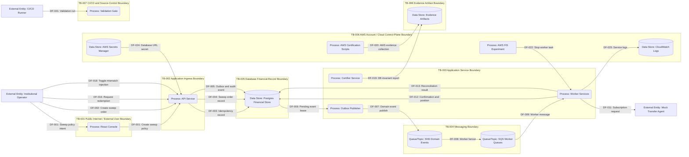

# DFD 00 System Boundary

This diagram shows the major external actors, runtime systems, data stores, queues, AWS sandbox services, CI/CD, and evidence outputs. Flow details and controls are defined in [data-flow-catalog.yaml](data-flow-catalog.yaml) and [control-map.yaml](control-map.yaml).

