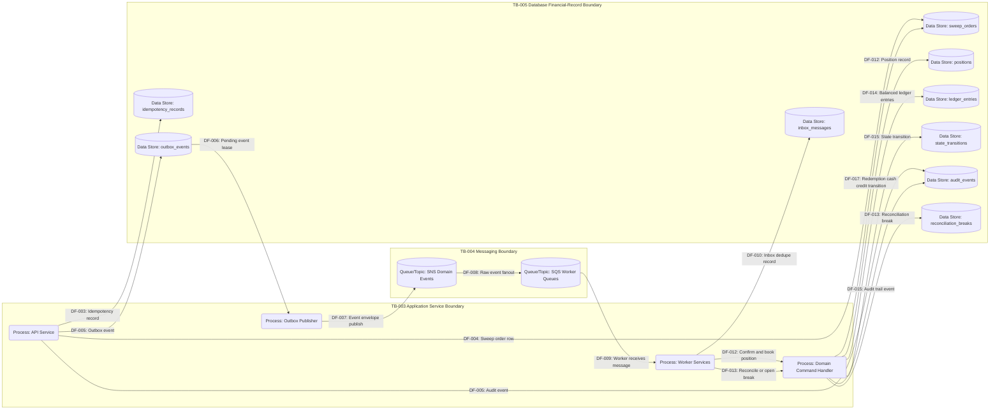

# DFD 01 Logical Runtime

This diagram shows the logical runtime flow from API persistence through outbox publication, queue fanout, worker processing, positions, ledger entries, audit events, and reconciliation.

