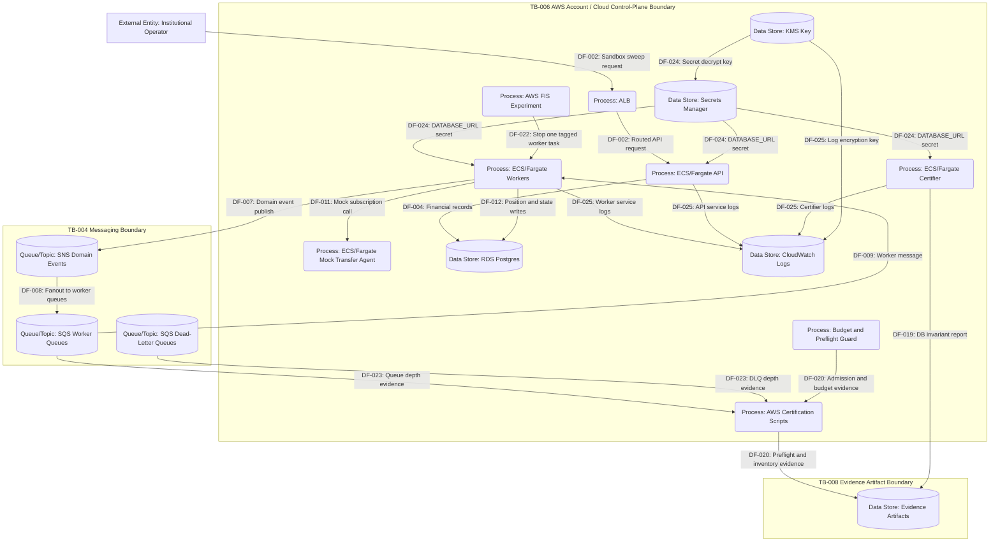

# DFD 02 AWS Sandbox

This diagram shows the opt-in, non-production AWS sandbox simulation. It does not describe production infrastructure.

```mermaid
flowchart TB
  EXT-001[External Entity: Institutional Operator]

  subgraph TB006["TB-006 AWS Account / Cloud Control-Plane Boundary"]
    P011(Process: Budget and Preflight Guard)
    P012(Process: ALB)
    P001(Process: ECS/Fargate API)
    P003(Process: ECS/Fargate Workers)
    P004(Process: ECS/Fargate Mock Transfer Agent)
    P007(Process: ECS/Fargate Certifier)
    P008(Process: AWS Certification Scripts)
    P010(Process: AWS FIS Experiment)
    DS001[(Data Store: RDS Postgres)]
    DS003[(Data Store: Secrets Manager)]
    DS005[(Data Store: CloudWatch Logs)]
    DS006[(Data Store: KMS Key)]
  end

  subgraph TB004["TB-004 Messaging Boundary"]
    MQ001[(Queue/Topic: SNS Domain Events)]
    MQ002[(Queue/Topic: SQS Worker Queues)]
    MQ003[(Queue/Topic: SQS Dead-Letter Queues)]
  end

  subgraph TB008["TB-008 Evidence Artifact Boundary"]
    DS004[(Data Store: Evidence Artifacts)]
  end

  EXT-001 -->|DF-002: Sandbox sweep request| P012
  P012 -->|DF-002: Routed API request| P001
  DS003 -->|DF-024: DATABASE_URL secret| P001
  DS003 -->|DF-024: DATABASE_URL secret| P003
  DS003 -->|DF-024: DATABASE_URL secret| P007
  DS006 -->|DF-024: Secret decrypt key| DS003
  P001 -->|DF-004: Financial records| DS001
  P003 -->|DF-012: Position and state writes| DS001
  P003 -->|DF-011: Mock subscription call| P004
  P003 -->|DF-007: Domain event publish| MQ001
  MQ001 -->|DF-008: Fanout to worker queues| MQ002
  MQ002 -->|DF-009: Worker message| P003
  MQ002 -->|DF-023: Queue depth evidence| P008
  MQ003 -->|DF-023: DLQ depth evidence| P008
  P010 -->|DF-022: Stop one tagged worker task| P003
  P008 -->|DF-020: Preflight and inventory evidence| DS004
  P007 -->|DF-019: DB invariant report| DS004
  P003 -->|DF-025: Worker service logs| DS005
  P001 -->|DF-025: API service logs| DS005
  P007 -->|DF-025: Certifier logs| DS005
  DS006 -->|DF-025: Log encryption key| DS005
  P011 -->|DF-020: Admission and budget evidence| P008
```
