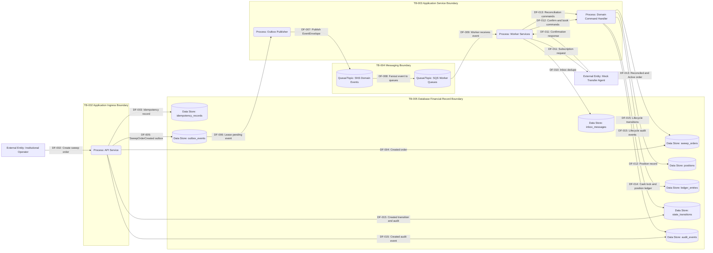

# DFD 03 Sweep Order Flow

This diagram shows the detailed sweep order path from request through persistence, outbox, SNS/SQS, worker dedupe, mock transfer-agent confirmation, position booking, ledger entries, reconciliation, and audit evidence.

