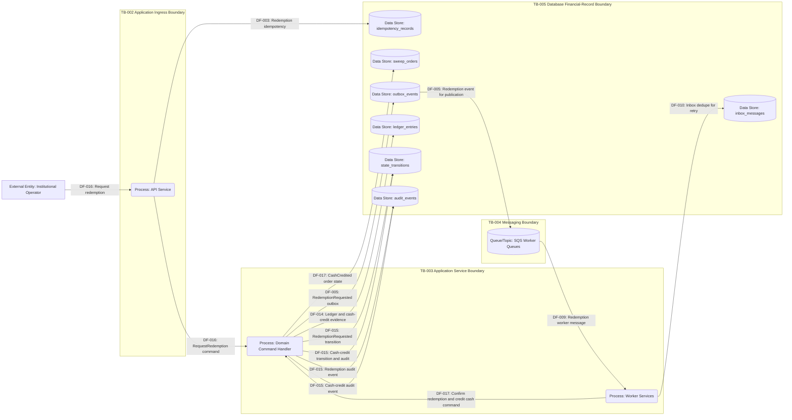

# DFD 04 Redemption Flow

This diagram shows redemption request handling, idempotency and replay behavior, modeled redemption processing, ledger and cash-credit evidence, outbox and audit events, and failure or retry behavior. The current public runtime exposes redemption request creation; the full settlement sequence is modeled by the domain transition path and tests.

