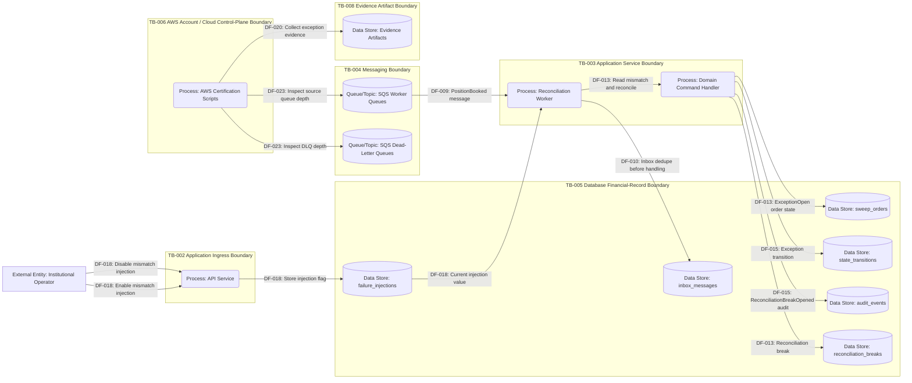

# DFD 05 Reconciliation Exception Flow

This diagram shows test-mode reconciliation mismatch injection, reconciliation worker behavior, exception opening, audit events, queue-drain evidence, and operator or evidence review paths.

